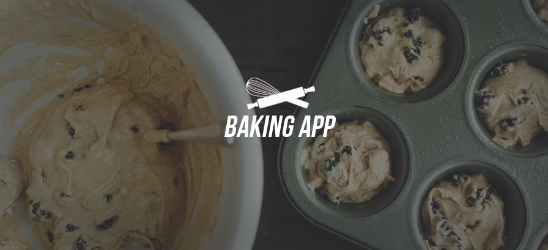
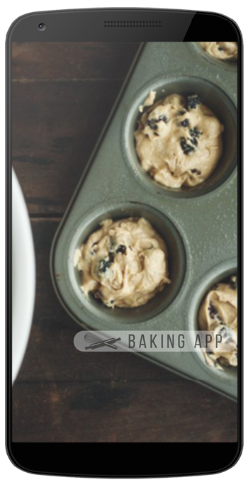
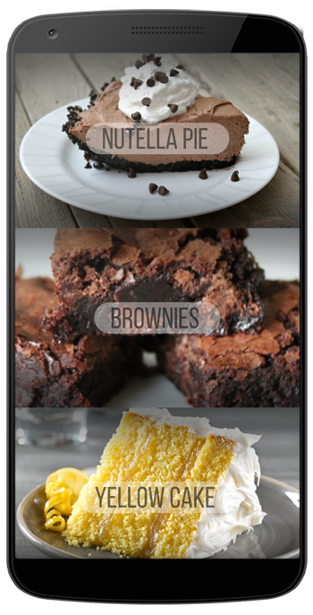
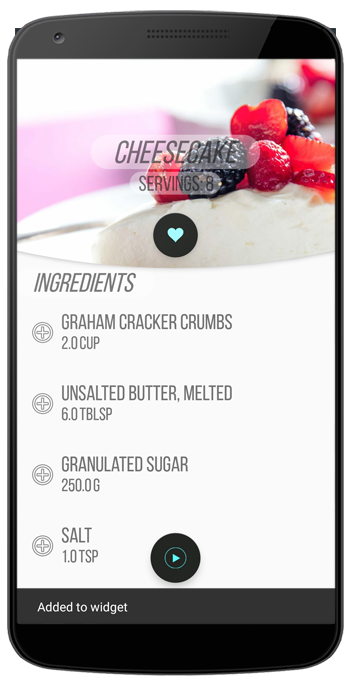
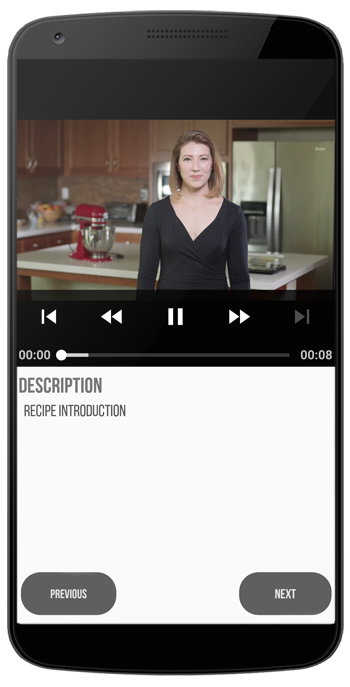
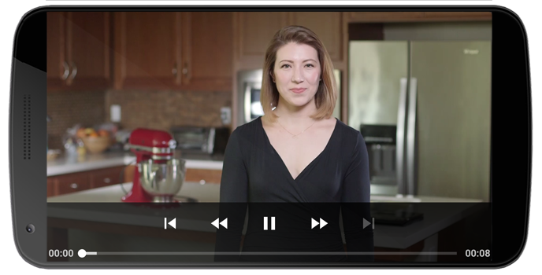
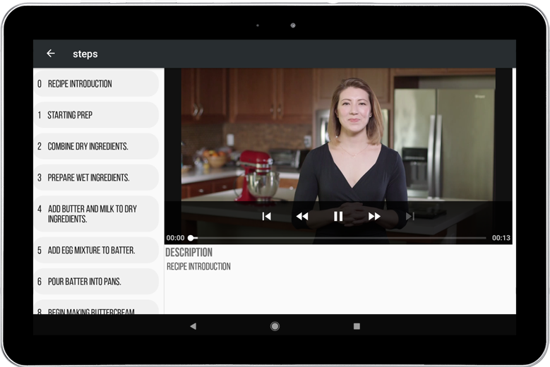

# BakingApp
Third project for the Udacity Android Developer Nanodegree.

## Screenshots
 
 

## Platform
Android OS
## Main Features 
* Allow chef to share his recipes with the world
* User can select a recipe and see video-guided steps for how to complete it.
* App widget that display the favourite recipe. 
## technical Features 
* App is written in Java.
* App utilizes stable release versions of all libraries, Gradle (v4.4) Android Studio  (v3.1.2).
* App use Exoplayer to display videos.
* Handle error cases in Android & unexpected network response
* Support widget to much more app experience.
* Use Fragments to create a responsive design that works on phones and tablets.

## Built With
* [Android Studio](https://developer.android.com/studio/index.html) - The Official IDE for Android
* [Photoshop](https://www.photoshop.com/) - for UI designing

## Used Libraries & SDKs
* [Android Support Libraries](https://developer.android.com/topic/libraries/support-library/packages.html)
* [DataBinding](https://developer.android.com/topic/libraries/data-binding/index.html)
* [Retrofit](https://square.github.io/retrofit/)
* [Picasso](http://square.github.io/picasso/)
* [KenBurnsView](https://github.com/flavioarfaria/KenBurnsView)
* [Shapeofview](https://github.com/florent37/ShapeOfView)
* [ExoPlayer](https://github.com/google/ExoPlayer)
* [Espresso](https://developer.android.com/training/testing/espresso/)
